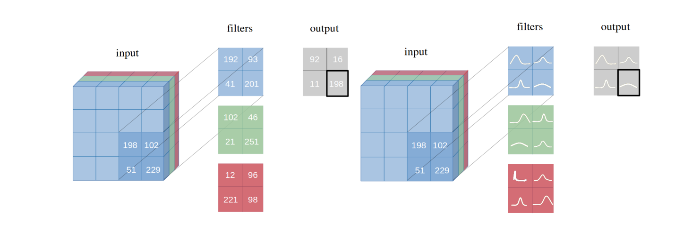
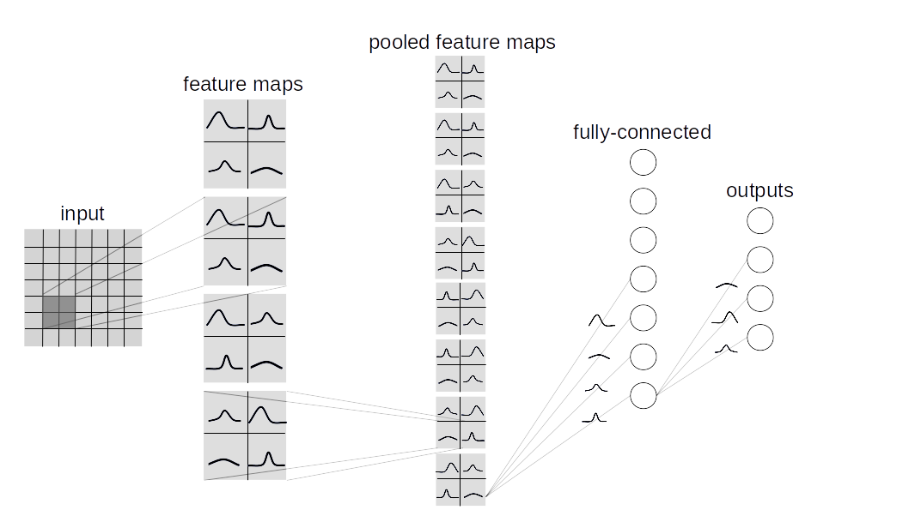

This introduces the Bayesian Neural Network and the main work is referenced to [Pytorch-BayesianCNN](https://github.com/kumar-shridhar/PyTorch-BayesianCNN/tree/master) but have some different things.

### The main different things

- add the Fashion-MNIST dataset to train
- add some visualizing methods of the model.

### Filter weight distributions in a Bayesian Vs Frequentist approach

---------------------------------------------------------------------------------------------------------

### Fully Bayesian perspective of an entire CNN

---------------------------------------------------------------------------------------------------------

### Layer types

This repository contains two types of bayesian lauer implementation:  
* **BBB (Bayes by Backprop):**  
  Based on [this paper](https://arxiv.org/abs/1505.05424). This layer samples all the weights individually and then combines them with the inputs to compute a sample from the activations.

* **BBB_LRT (Bayes by Backprop w/ Local Reparametrization Trick):**  
  This layer combines Bayes by Backprop with local reparametrization trick from [this paper](https://arxiv.org/abs/1506.02557). This trick makes it possible to directly sample from the distribution over activations.
---------------------------------------------------------------------------------------------------------

